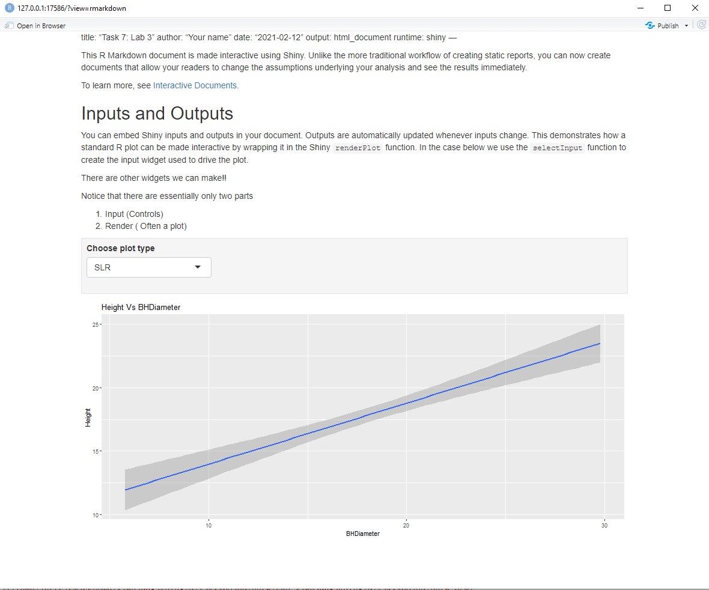
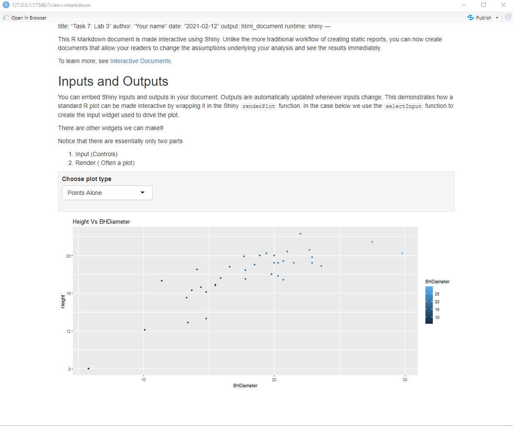
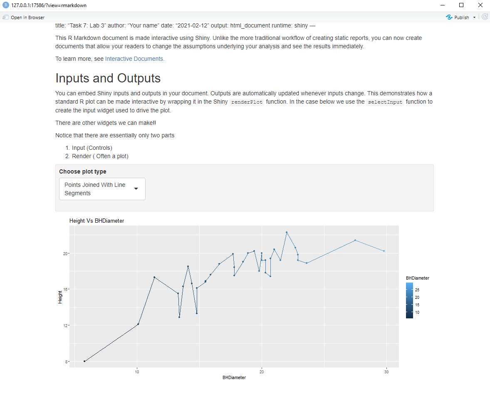

```{r setup, include=FALSE}
knitr::opts_chunk$set(echo = TRUE)
```

# Tasks

## Task 1

```{r}
getwd()
```

## Task 2

```{r}
spruce.df = read.csv("SPRUCE.csv")
head(spruce.df)
```

## Task 3

**Tree Height vs BHDiameter Plot**

```{r}
plot(Height~BHDiameter, main = "Tree Height vs BHDiameter", xlab = "Breast Height Diameter (cm)", ylab = "Height of Tree (m)", pch = 21, bg = "blue", cex = 1.2, xlim = c(0,max(BHDiameter) *1.1), ylim = c(0, max(Height) * 1.1), data = spruce.df)
```

Based on graph, there appears to be partial straight line relationship.

```{r}
library(s20x)

lo = layout(matrix(1:3, nr = 3, nc = 1, byrow = TRUE))
tsone = trendscatter(Height~BHDiameter, f = 0.5, data = spruce.df)
tstwo = trendscatter(Height~BHDiameter, f = 0.6, data = spruce.df)
tsthree = trendscatter(Height~BHDiameter, f = 0.7, data = spruce.df)
```

```{r}
spruce.lm = with(spruce.df, lm(Height~BHDiameter)) #lm=linear model, y~x
summary(spruce.lm) #9.15 = beta0hat, 0.48 = beta1hat

plot(Height~BHDiameter, main = "Tree Height vs BHDiameter", xlab = "Breast Height Diameter (cm)", ylab = "Height of Tree (m)", pch = 21, bg = "blue", cex = 1.2, xlim = c(0,max(BHDiameter) *1.1), ylim = c(0, max(Height) * 1.1), data = spruce.df)
abline(spruce.lm)
```

I believe the straight line is appropriate for the plot, but the smoother curve fits the data slightly better.
This is because the data has some what of a curved trend to it, but with the limited amount of data we have, the
straight line (linear model) fits it somewhat well. 

## Task 4

**4-Square Plot**

```{r}
lo = layout(matrix(1:4, nr = 2, nc = 2, byrow = TRUE))
layout.show(4)

plot(Height~BHDiameter, main = "Tree Height vs BHDiameter", xlab = "Breast Height Diameter (cm)", ylab = "Height of Tree (m)", pch = 21, bg = "blue", cex = 1.2, xlim = c(0,max(BHDiameter) *1.1), ylim = c(0, max(Height) * 1.1), data = spruce.df)
abline(spruce.lm)

plot(Height~BHDiameter, main = "RSS", xlab = "Breast Height Diameter (cm)", ylab = "Height of Tree (m)", pch = 21, bg = "blue", cex = 1.2, xlim = c(0,max(BHDiameter) *1.1), ylim = c(0, max(Height) * 1.1), data = spruce.df)
abline(spruce.lm)
yHat=with(spruce.df,predict(spruce.lm, data.frame(BHDiameter)))
with(spruce.df, segments(BHDiameter, Height, BHDiameter, yHat))

plot(Height~BHDiameter, main = "MSS", xlab = "Breast Height Diameter (cm)", ylab = "Height of Tree (m)", pch = 21, bg = "blue", cex = 1.2, xlim = c(0,max(BHDiameter) *1.1), ylim = c(0, max(Height) * 1.1), data = spruce.df)
abline(spruce.lm)
with(spruce.df, abline(h=mean(Height)))
with(spruce.df, segments(BHDiameter,mean(Height),BHDiameter,yHat,col="Red"))

plot(Height~BHDiameter, main = "TSS", xlab = "Breast Height Diameter (cm)", ylab = "Height of Tree (m)", pch = 21, bg = "blue", cex = 1.2, xlim = c(0,max(BHDiameter) *1.1), ylim = c(0, max(Height) * 1.1), data = spruce.df)
abline(spruce.lm)
with(spruce.df, abline(h=mean(Height)))
with(spruce.df, segments(BHDiameter,Height,BHDiameter,mean(Height),col="Green"))
```

**Calculate TSS, MSS, and RSS**

```{r}
RSS=with(spruce.df,sum((Height-yHat)^2))
MSS=with(spruce.df,sum((yHat-mean(Height))^2))
TSS=with(spruce.df,sum((mean(Height)-Height)^2))
RSS
MSS
TSS
```

**Calculate MSS/TSS and interpret it**

```{r}
MSS/TSS
```

MSS/TSS, otherwise known as R^2, shows how reliably the linear model fits the data. The calculated value of 0.657 shows that the linear model doesn't fit very well.

**Does TSS=MSS+RSS?**

```{r}
TSS
MSS+RSS
```

Yes,TSS=MSS+RSS.

##Task 5

**Summarize spruce.lm**

```{r}
summary(spruce.lm)
```

**Value of slope and intercept? Equation of fitted line?**

Slope = 0.48147
Intercept = 9.14684
Equation: Height = (BHDiameter * 0.48147) + 9.14684

**Predict height of spruce when diameter is 15, 18, and 20cm**

```{r}
predict(spruce.lm, data.frame(BHDiameter=c(15,18,20)))
```

15cm: 16.36895 
18cm: 17.81338 
20cm: 18.77632 

## Task 6

**Height vs. Diameter Plot**

```{r}
library(ggplot2)
g=ggplot(spruce.df, aes(x=BHDiameter,y=Height,colour=BHDiameter))
g=g+geom_point() + geom_line()+ geom_smooth(method="lm")
g+ggtitle("Height vs. BHDiameter",)
```

## Task 7

{ width=70% }
{ width=70% }
{ width=70% }


